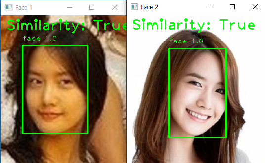

# Object Detection Hands-on with ChatGPT
* Object Detection
* Face Recognition
* Face Comparision

---
# Hands-on Environment
<div class="columns">
<div>

#### Python virtual environment
- [Anaconda](https://www.anaconda.com/download) / [Miniconda](https://docs.conda.io/projects/miniconda/en/latest/) / [venv](https://docs.python.org/3/library/venv.html) / [VirtualEnv](https://pypi.org/project/virtualenv/)  

#### IDE or Editor
- [VS Code](https://code.visualstudio.com/download) / [PyCharm](https://www.jetbrains.com/pycharm/download/?section=windows) / [Notepad++](https://notepad-plus-plus.org/downloads/)

#### Object detection library
- [OpenCV](https://opencv.org/) / [ImageAI](https://imageai.readthedocs.io/en/latest/) / [AWS Rekognition](https://aws.amazon.com/rekognition/) / [Azure AI Vision](https://azure.microsoft.com/en-us/products/ai-services/ai-vision)

#### ChatGPT
- [OpenAI](https://chat.openai.com/auth/login) / [Bing Chat](https://www.bing.com/search?form=MY0291&OCID=MY0291&q=Bing+AI&showconv=1) / Skype

</div>

<div>

#### My Environment 
- Windows 10 / Miniconda /
  Python 3.11.4 / VS code / Skype

  

</div>

---
# OpenCV Object detection in image

<div class="columns">
<div>

#### [Question](1_question_for_detect_object.txt) to ChatGPT 
```
python code for object detection using OpenCV and Yolo

1. read input file name and result file name with 
confidence as parameter like "detect_object.py 
input.jpg output.jpg 0.5"
2. read input file and detect objects in the input file, 
and draw box and confidence value around detect objects
3. write result file and show input and resuult both
```

#### Modify [answer](1_answer_for_detect_object.txt) code if needed

### Download [YOLO model](https://pjreddie.com/darknet/yolo/), [coco.names](https://github.com/pjreddie/darknet/blob/master/data/coco.names)

#### Install **cv2** and **numpy** packages and
```
pip install opencv-contrib-python numpy
```

</div>

<div>

#### Run result [code](detect_object.py)

```
detect_object.py input.jpg result.jpg 0.5
```

</div>

---
# OpenCV Face Recognition in image

<div class="columns">
<div>

#### [Question](2_question_for_face_recognition.txt) to ChatGPT 
```
python code for face recognition using OpenCV and Yolo

1. read input file name and result file name with 
confidence as parameter like "detect_face.py 
input.jpg output.jpg 0.5"
2. read input file and detect faces in the input file, 
and draw box and confidence value around detected faces
3. write result file and show input and resuult both
```

#### Modify [answer](2_answer_for_face_recognition.txt) code if needed

#### Download [yolov3-face.weights, yolov3-face.cfg](https://huggingface.co/spaces/simayhosmeyve/Image_Enhancement/tree/92d7f4409bf83af30fb5a619a7db5be2958c7a88)

</div>

<div>

#### Run result [code](detect_object.py)

```
detect_face.py input.jpg result.jpg 0.5
```

</div>

---
# OpenCV Compare Faces in images

<div class="columns">
<div>

#### [Question](3_question_for_compare_faces.txt) to ChatGPT 
```
python code for face comparison using OpenCV and Yolo
1. read face files names as parameter like 
"compare_faces.py face1.jpg face2.jpg"
2. read face files have one face in each file and 
detect face and compare faces. 
3. draw box around faces and write similarity.
4. show each file with box and similarity
```

#### Modify [answer](3_answer_for_compare_faces.txt) code if needed

#### Create a Python 3.8 environment
###### [face_recognition](https://pypi.org/project/face-recognition/) needs [Dlib](https://github.com/sachadee/Dlib) which works on python 3.7, 3.8, 3.9
  ```
  conda create -n face_recognition python=3.8
  ```

</div>

<div>

#### Install [Dlib](https://github.com/sachadee/Dlib) and [face_recognition](https://pypi.org/project/face-recognition/)

```
pip install dlib-19.22.99-cp38-cp38m-win_amd64.whl
pip install face_recognition
```
#### Run result [code](detect_object.py)

```
compare_face.py face1.jpg face2.jpg
```

</div>